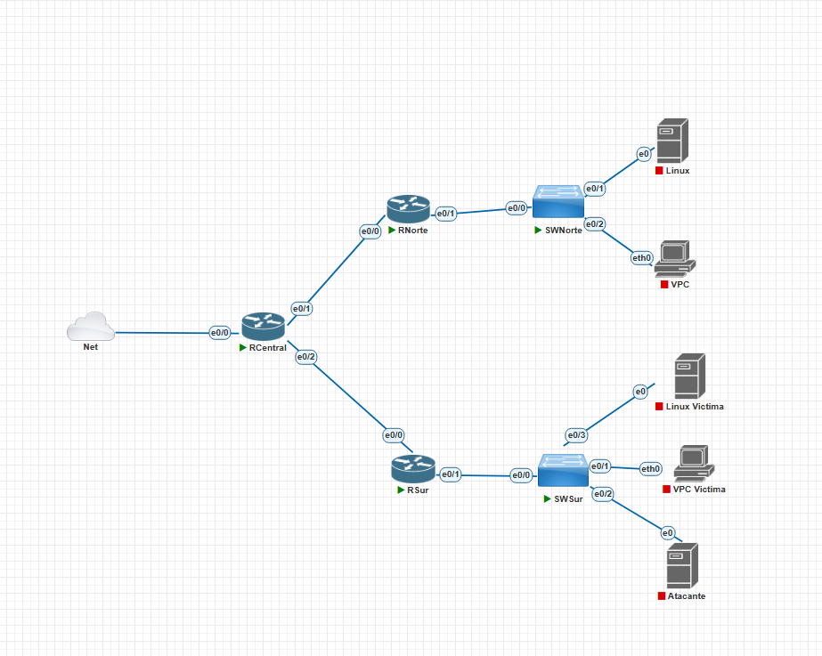
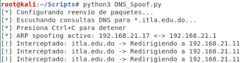
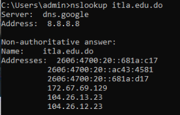
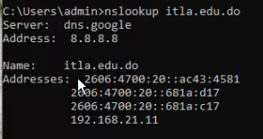
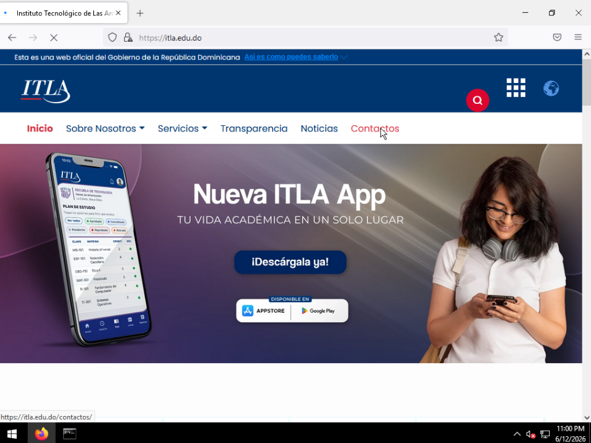
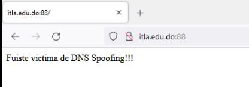

# INFORME TÉCNICO: DNS SPOOFING Y SUPLANTACIÓN DE SERVICIO WEB LOCAL
## Materia: Seguridad de Redes (TSI-203)
**Profesor:** Jonathan Esteban Rondon Corniel  
**Estudiante:** Alan Daniel Garcia Mendez  
**Matrícula:** 2025-1403  
**Carrera:** Seguridad Informática (TSI)  
**Institución:** Instituto Tecnológico de Las Américas (ITLA)  
**Fecha:** 12 de junio de 2026  
**Video Demostrativo (Paso a Paso):** [Ver en YouTube (https://youtu.be/4i1WT7Z-MiU)](https://youtu.be/4i1WT7Z-MiU)

---


## 📋 1. Objetivo del Laboratorio

Demostrar los vectores de ataque combinados de capa 2 y capa 7 mediante **ARP Poisoning** (envenenamiento de tablas ARP) y **DNS Spoofing** (suplantación de DNS). El objetivo del laboratorio es ilustrar cómo un atacante situado en la misma red de área local (VLAN 30 en nuestro laboratorio) puede interceptar y alterar la resolución del nombre de dominio legítimo `itla.edu.do` para desviar las peticiones HTTP de la víctima hacia un servidor Apache2 local bajo el control del atacante, demostrando los riesgos asociados a la devaluación de la integridad en los protocolos de red locales.

---

## 🗺️ 2. Topología de la Red de Laboratorio

El laboratorio fue diseñado y emulado en PNETLab utilizando la siguiente arquitectura de red:


*PNETLab Topology: Muestra la interconexión entre el Router Central (RCentral), Router de la sede Sur (RSur), Switch local (SWSur), la máquina Windows Víctima (Win Victima) y el host Atacante.*

---

## 💻 3. Objetivo y Funcionamiento del Script (`AlanGarcia_2025-1403_DNS_Spoof_P4.py`)

El script [AlanGarcia_2025-1403_DNS_Spoof_P4.py](AlanGarcia_2025-1403_DNS_Spoof_P4.py) es una herramienta modular desarrollada en Python utilizando la biblioteca **Scapy**. Su diseño implementa programación concurrente (multithreading) para coordinar las fases del ataque de manera eficiente sin colisionar con el procesamiento normal de la red.

### Lógica Interna del Motor (`DnsHijackEngine`):

```text
            [ Hilo 1: ARP Poisoning Thread ]
           +--------------------------------+
           | Envia tramas ARP falsas cada   |
           | 2.5s para forzar MitM:         |
           |  - Victima cree que Atacante=GW|
           |  - Gateway cree que Atacante=V |
           +--------------------------------+
                          ^
                          |
  Victima (V) ---------> [ Atacante (Kali) ] ---------> Gateway (GW)
                          | (Habilita IP Forwarding)
                          v
            [ Hilo 2: DNS Interceptor (Main) ]
           +--------------------------------+
           | Sniffea UDP puerto 53 en eth0. |
           | Si qname contiene "itla.edu.do"|
           | inyecta respuesta DNS falsa    |
           | apuntando a la IP del Atacante.|
           +--------------------------------+
```

<div class="article-block">

El script implementa los siguientes pasos ordenados:

1. **Activación de IP Forwarding:** Ejecuta `sysctl -w net.ipv4.ip_forward=1` para que el kernel de Linux de la máquina atacante reenvíe las tramas normales de la víctima hacia el gateway y viceversa. De esta forma, la víctima no pierde el acceso a Internet y el ataque permanece indetectable.
2. **Resolución de Direcciones de Hardware (ARP Broadcast):** Envía peticiones ARP para conocer las direcciones MAC reales de la víctima y del gateway, almacenándolas en memoria cache (`self.mac_cache`).
3. **Hilo de Manipulación ARP (Envenenamiento Continuo):**
   * Levanta un hilo de ejecución independiente (`daemon=True`) que ejecuta el método `arp_manipulation()`.
   * Envía tramas ARP de respuesta (op=2) cada 2.5 segundos:
     * A la víctima: asocia la IP del router con la MAC de Kali.
     * Al router: asocia la IP de la víctima con la MAC de Kali.
4. **Sniffing y Filtrado de Consultas DNS:**
   * En el hilo principal, ejecuta la función `sniff()` de Scapy con el filtro `"udp and port 53"`.
   * Procesa cada consulta capturada a través del método `packet_callback()`.
5. **Inyección de Respuestas DNS Falsificadas:**
   * Al capturar una consulta DNS (`qd.qname`) que contenga el dominio `itla.edu.do`, el atacante ensambla una respuesta DNS maliciosa utilizando la clase `craft_fake_response()`.
   * La trama falsificada clona el ID de la transacción DNS original (`original_pkt[DNS].id`), pone el flag de respuesta en activo (`qr=1`) y añade un registro de recurso de respuesta (`DNSRR`) que asocia el dominio consultado con la dirección IP del atacante (`self.host_ip`).
   * Para asegurar el éxito, el script envía la respuesta maliciosa **3 veces seguidas**, ganándole la carrera de velocidad de transmisión al servidor DNS real del ISP o de la red local.

</div>

---

## ⚙️ 4. Parámetros del Script y Requisitos

### Requisitos del Sistema
* **Entorno:** Kali Linux o Debian/Ubuntu con privilegios de root (`sudo`).
* **Librerías Python:**
  * `scapy` (Para la creación e inyección de paquetes de red). Se instala con `sudo apt install python3-scapy` o `pip install scapy`.
* **Servicio Web Local:**
  * Apache2 o Nginx instalado y corriendo en Kali Linux: `sudo systemctl start apache2`.
  * La plantilla HTML de suplantación colocada en la raíz del servidor web de Linux (`/var/www/html/index.html`).

### Parámetros del Script
En la clase inicializadora `DnsHijackEngine` se deben definir las siguientes variables según el direccionamiento real del laboratorio:
```python
self.iface = "eth0"                  # Interfaz de red local de Kali
self.host_ip = "192.168.21.11"        # IP de la máquina Kali Linux (Atacante)
self.target_host = "192.168.21.17"    # IP de la máquina de la Víctima (Windows/Linux)
self.router_ip = "192.168.21.1"       # IP del Router (Gateway de la VLAN)
self.hijack_domain = "itla.edu.do"    # Dominio objetivo a suplantar
```

---

## ⚡ 5. Guía de Ejecución y Evidencia Práctica

### Paso 1: Montar la página web de Phishing
Copiar la plantilla del portal de ITLA al directorio del servidor web de Kali Linux:
```bash
sudo cp -r fake_site/* /var/www/html/
sudo systemctl restart apache2
```

### Paso 2: Iniciar el script de ataque
Ejecutar el script Python con privilegios de administrador:
```bash
sudo python3 AlanGarcia_2025-1403_DNS_Spoof_P4.py
```

Al ejecutarse, el motor realiza el forwarding, inicia el ARP poisoning en segundo plano y comienza el sniffing de consultas DNS:


*Salida de consola en Kali Linux: Muestra el inicio exitoso del envenenamiento ARP y la intercepción y suplantación en tiempo real de consultas DNS para itla.edu.do.*

---

### Paso 3: Validación del Ataque desde la Víctima

<div class="article-block">

#### A. Verificación del Registro DNS mediante `nslookup` (Antes vs. Después)

1. **Resolución Normal (Sin Ataque):**
   Al realizar la consulta antes de activar el spoofing, se obtienen las direcciones IPv4 e IPv6 públicas legítimas del ITLA (gestionadas a través de Cloudflare):

   
   *Resolución normal: Muestra las direcciones IP legítimas correspondientes a los servidores de producción de itla.edu.do.*

2. **Resolución Suplantada (Bajo Ataque):**
   Una vez en marcha el script de ataque, se inyecta con éxito la dirección IP local del atacante (`192.168.21.11`) en el listado de direcciones devueltas a la víctima:

   
   *Resolución suplantada: Se inyecta la IP local del atacante (192.168.21.11) para forzar la redirección del tráfico HTTP.*

</div>

<div class="article-block">

#### B. Comportamiento en la Navegación (Antes vs. Después)

1. **Navegación Normal (Sin Ataque):**
   La víctima accede a la página oficial, encriptada bajo HTTPS y apuntando a los servidores legítimos del ITLA:

   
   *Acceso legítimo: Visualización del portal auténtico de ITLA.*

2. **Navegación Infectada (Bajo DNS Spoofing):**
   Al ingresar al dominio, la víctima es redirigida al servidor web local del atacante (puerto 88), donde visualiza el aviso de suplantación:

   
   *Redirección maliciosa: El navegador de la víctima muestra el mensaje de alerta local "Fuiste victima de DNS Spoofing!!!".*

---

</div>

## 🛡️ 6. Contra-medidas y Mitigaciones (Seguridad Multi-capa)

Mitigar ataques de suplantación de red requiere un enfoque de defensa en profundidad distribuida en las capas 2, 3 y 7 del modelo OSI.

### A. Mitigación en Capa 2 (Switching Cisco)

<div class="article-block">

#### 1. DHCP Snooping
Crea una base de datos lógica de direcciones IP y direcciones MAC asociadas a puertos físicos del switch ("Binding Database"). Define qué puertos del switch son confiables (como los conectados a servidores DHCP y routers) y cuáles no (usuarios).
```ios
SWSur(config)# ip dhcp snooping
SWSur(config)# ip dhcp snooping vlan 30
SWSur(config)# interface GigabitEthernet0/1
SWSur(config-if)# ip dhcp snooping trust
```

</div>

<div class="article-block">

#### 2. Dynamic ARP Inspection (DAI)
Utiliza la base de datos de DHCP Snooping para validar las tramas ARP que transitan por el switch. Si un dispositivo intenta enviar una trama ARP de respuesta alegando poseer una IP que no coincide con su MAC registrada en la base de datos de DHCP Snooping, el switch descarta la trama de inmediato, bloqueando el ARP Poisoning.
```ios
SWSur(config)# ip arp inspection vlan 30
```

</div>

### B. Mitigación en Capa 7 (DNS y Criptografía)

<div class="article-block">

#### 1. DNSSEC (Domain Name System Security Extensions)
Añade firmas criptográficas a los registros de DNS existentes. Cuando el cliente consulta un dominio, puede validar la firma digital utilizando claves públicas para cerciorarse de que el registro DNS no ha sido alterado en el camino.

</div>

<div class="article-block">

#### 2. DNS sobre HTTPS (DoH) y DNS sobre TLS (DoT)
Cifra las consultas y respuestas DNS en un túnel seguro (DoT usa puerto TCP 853 y DoH encapsula en HTTPS puerto TCP 443). Al estar encriptadas, un atacante posicionado en el medio (MitM) no puede leer la consulta DNS ni mucho menos inyectar respuestas falsas válidas.

</div>

<div class="article-block">

#### 3. HTTPS y HSTS (HTTP Strict Transport Security)
* **HTTPS:** Cifra el tráfico de la web. Si la víctima es redirigida a la IP del atacante (`192.168.21.11`), el navegador de la víctima intentará establecer una sesión SSL/TLS con el dominio `itla.edu.do`. Como el atacante no posee el certificado SSL válido firmado por una Autoridad Certificadora (CA) de confianza para ese dominio, el navegador bloqueará la conexión alertando de un peligro de seguridad crítico.
* **HSTS:** Cabecera de respuesta HTTP que obliga a los navegadores a conectarse al sitio web únicamente mediante conexiones HTTPS seguras, impidiendo que los usuarios ignoren las advertencias de seguridad de los certificados SSL falsos.
</div>
